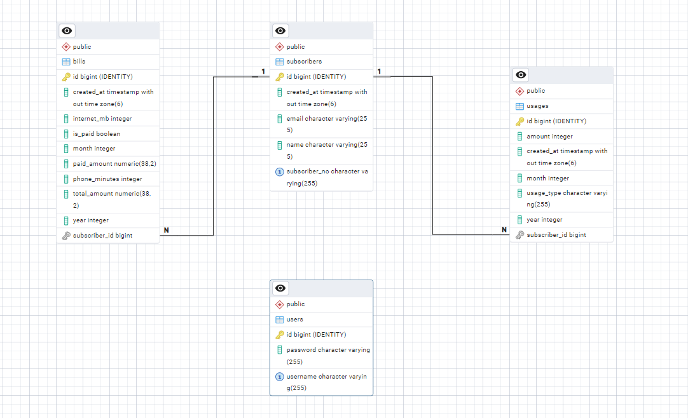

# Mobile Provider Billing API

This is a Spring Boot-based RESTful API for managing subscribers, tracking usage, calculating bills, and handling payments for a mobile provider system. It is implemented as part of a midterm project for SE4458.

---

## Features

- Subscriber management
- Phone & internet usage tracking
- Bill calculation logic
- JWT authentication for protected endpoints
- Pagination and sorting for detailed billing queries
- Swagger UI integration for interactive API documentation

---

## Technologies Used

- Java 17
- Spring Boot 3.x
- Spring Data JPA
- Spring Security
- PostgreSQL (hosted on Render)
- Swagger (springdoc-openapi)
- JWT (jjwt)

---

## Database Configuration

**Render PostgreSQL Connection (example):**

```
spring.datasource.url=jdbc:postgresql://dpg-....render.com:5432/billing_system_db
spring.datasource.username=admin
spring.datasource.password=YOUR_PASSWORD
```

Ensure your database is correctly configured before running the app.

---

## Authentication

Use the `/api/v1/auth/login` endpoint to receive a JWT token. Token must be passed as a Bearer Token in the `Authorization` header for protected endpoints.

---

## API Endpoints Overview

### 🔓 Public Endpoints

| Endpoint                         | Description            |
|----------------------------------|------------------------|
| `POST /api/v1/auth/login`        | Login and receive token |
| `POST /api/v1/subscribers`       | Create subscriber       |
| `GET /api/v1/bill/history`       | Query bill total/payout status |
| `POST /api/v1/bill/pay`          | Pay a bill (no JWT needed)    |

### 🔐 JWT-Protected Endpoints

| Endpoint                            | Description                         | Paging | Sorting |
|-------------------------------------|-------------------------------------|--------|---------|
| `POST /api/v1/usage`                | Add 10 mins (phone) / 1MB (internet)|   ❌   |   ❌    |
| `GET /api/v1/bill/calculate`        | Calculates bill from usage          |   ❌   |   ❌    |
| `GET /api/v1/bill/detailed`         | Returns bill details + breakdown    |   ✅   |   ✅    |
| `GET /api/v1/subscribers`           | Get all subscribers                 |   ❌   |   ❌    |
| `GET /api/v1/subscribers/{subNo}`   | Get specific subscriber by number   |   ❌   |   ❌    |

---

## Sample Payloads

### ✅ Login

```bash
POST /api/v1/auth/login
?username=admin&password=1234
```

Returns:

```json
{ "token": "Bearer eyJ..." }
```

### 📥 Create Subscriber

```json
{
  "subscriberNo": "1001",
  "name": "Doga",
  "email": "doga@example.com"
}
```

### 📊 Add Usage

```http
POST /api/v1/usage?subscriberNo=1001&usageType=PHONE&month=4&year=2025
```

### 🧮 Calculate Bill

```http
GET /api/v1/bill/calculate?subscriberNo=1001&month=4&year=2025
```

### 📄 Detailed Bill (Paging + Sorting)

```http
GET /api/v1/bill/detailed?subscriberNo=1001&page=0&size=5&sortBy=year,desc
```

### 💸 Pay Bill

```http
POST /api/v1/bill/pay?subscriberNo=1001&month=4&year=2025&amount=75.00
```

---

## ⚙️ Swagger UI

🔗 API Base URL: [`https://se4458-midterm-project.onrender.com`](https://se4458-midterm-project.onrender.com)  
🔗 Swagger UI: [`https://se4458-midterm-project.onrender.com/swagger-ui.html`](https://se4458-midterm-project.onrender.com/swagger-ui.html)

Use the **"Authorize"** button to enter your JWT token.

---

## 🚀 Deployment

This project is deployed on [Render](https://render.com/)  
🔗 **Live URL:** [https://se4458-midterm-project.onrender.com](https://se4458-midterm-project.onrender.com)  
🔗 **Swagger UI:** [https://se4458-midterm-project.onrender.com/swagger-ui.html](https://se4458-midterm-project.onrender.com/swagger-ui.html)

---

## 🧪 Running the Project

1. Clone this repository
2. Make sure your PostgreSQL database is deployed (e.g. Render.com)
3. Update `application.properties` with your remote DB connection:

```
spring.datasource.url=jdbc:postgresql://<render-db-host>:5432/<dbname>
spring.datasource.username=<your-db-username>
spring.datasource.password=<your-db-password>
```

4. Run:
```
./mvnw spring-boot:run
```

---

## 📊 Entity-Relationship Diagram

A visual representation of the database structure used in this project:




---

## 📎 Notes
- Billing calculations include base and excess usage.
- Payment endpoint accepts partial payments.
- The database schema is automatically generated at runtime.

---

### 🎥 Sunum Videosu

[📺 Videoyu buradan izleyin](https://drive.google.com/file/d/1PSb30VURlXkkBAaMPZRxN4KO1gCn6jML/view?usp=sharing)

---

## License

This project was developed for educational purposes as part of the **SE4458 - Büyük Ölçekli Sistemler** course at **Yaşar University** (Midterm Project - 2025).
